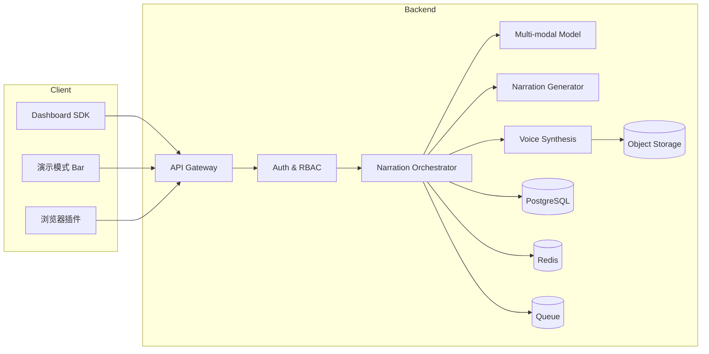
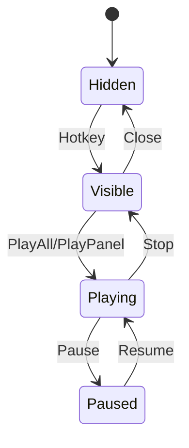
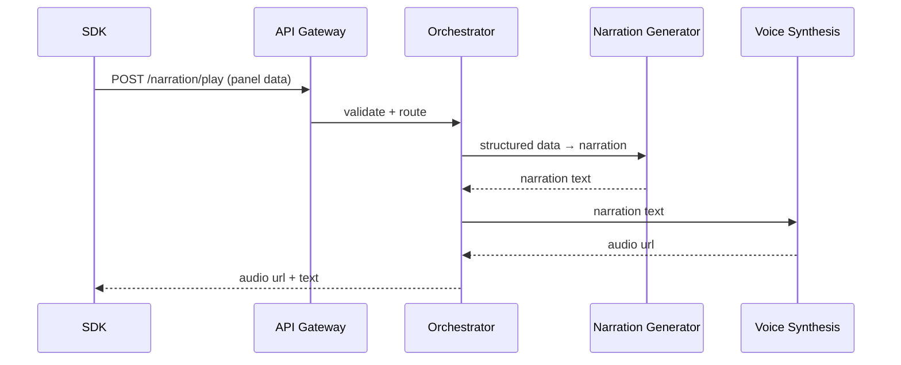
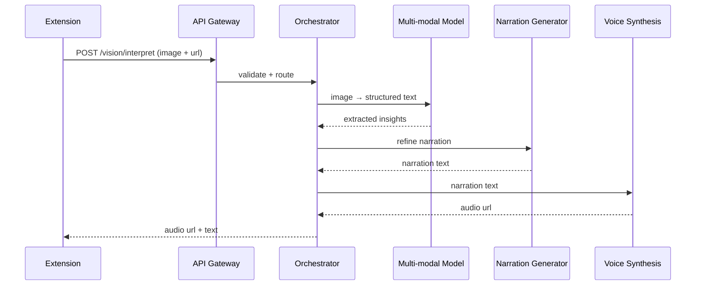

# 详细设计（Detailed Design）— DashStory Dashboard 解读 SaaS

> 版本：v1.0  
> 作者：架构评审与设计  
> 日期：2026-02-03  
> 适用范围：SDK、演示模式 bar、浏览器插件、AI 编排与语音服务

## 目录
- [摘要（Executive Summary）](#摘要executive-summary)
- [1. 设计目标与约束](#1-设计目标与约束)
- [2. 总体架构](#2-总体架构)
- [3. 关键组件设计（MECE）](#3-关键组件设计mece)
- [4. 关键流程设计](#4-关键流程设计)
- [5. 数据模型与接口](#5-数据模型与接口)
- [6. 语义解读与提示词策略](#6-语义解读与提示词策略)
- [7. 安全、隐私与合规](#7-安全隐私与合规)
- [8. 性能与容量规划](#8-性能与容量规划)
- [9. 可观测性与运维](#9-可观测性与运维)
- [10. 失败处理与降级](#10-失败处理与降级)
- [11. 测试与验收](#11-测试与验收)
- [12. 里程碑与交付清单](#12-里程碑与交付清单)
- [13. 需确认事项](#13-需确认事项)

---

## 摘要（Executive Summary）
本详细设计围绕“Dashboard → 结构化语义 → 文字解读 → 语音播放”的全链路，分别对 **SDK 集成路径** 与 **浏览器插件路径** 做到组件级拆解与接口级定义。整体架构采用 **前端轻集成 + 后端编排服务** 模式，并通过 **多模态识别、叙事生成、语音合成** 三段式流水线实现低延迟解读。设计重点覆盖：  
1) 多 panel 数据的标准化与可解释性；  
2) 演示模式 bar 的交互与状态机；  
3) 插件截图识别与敏感信息保护；  
4) 多租户鉴权、用量计费与可观测性。

---

## 1. 设计目标与约束
### 1.1 设计目标
1) **低集成成本**：SDK 集成时间 ≤ 1 天（URD 目标）；  
2) **低延迟体验**：端到端 P95 ≤ 5 秒（URD 目标）；  
3) **可解释输出**：输出文本具备“summary / highlights / risks / nextActions”结构；  
4) **可控风险**：截图与数据最小化存储，支持删除与脱敏。

### 1.2 设计约束
1) 与客户现有 Dashboard 技术栈解耦，SDK 不依赖框架；  
2) 插件需在 Chrome/Edge 最新 2 个版本可用；  
3) 合规优先，任何音频留存需可配置与可审计。

---

## 2. 总体架构
### 2.1 架构分层
- **接入层**：SDK、浏览器插件、管理控制台  
- **编排层**：API Gateway、Auth、Narration Orchestrator  
- **AI 能力层**：多模态识别、叙事生成、TTS  
- **基础设施层**：对象存储、数据库、缓存、队列、监控

### 2.2 逻辑架构图


---

## 3. 关键组件设计（MECE）
### 3.1 SDK 组件
**职责**：采集 panel 数据、提供语义元数据、触发解读与播放。  
**模块拆分**：  
1) **Panel Registry**：管理 panel 元数据与数据快照；  
2) **Data Normalizer**：统一时间序列、分布、对比类数据格式；  
3) **Event Bus**：发布“panel 更新/播放状态”事件；  
4) **Hotkey Manager**：快捷键注册、冲突检测；  
5) **Network Client**：调用后端解读与 TTS 服务；  
6) **Bar UI Adapter**：注入与挂载演示模式 bar。

**关键设计点**：  
- panel 的唯一性由 `panelId` 保证；  
- 多 panel 更新采用 `batch` 接口，减少网络往返；  
- 数据刷新最小粒度 1 秒由 SDK 防抖控制，避免后端过载。

### 3.2 演示模式 Bar
**职责**：快速召唤、选择语音与播放控制。  
**状态机**：


**UI 最小要素**：  
1) Voice Selector；  
2) Panel Selector；  
3) Play/Stop/Pause；  
4) Speed Toggle；  
5) Status Indicator（当前 panel + 进度）。

### 3.3 浏览器插件
**职责**：截图采集、遮盖敏感信息、调用多模态识别与播放语音。  
**架构**：  
- **Content Script**：页面截取与遮盖；  
- **Background**：与后端 API 通信；  
- **Popup/Panel**：展示结果与播放控件。

**关键设计点**：  
1) 截图前明确展示权限与敏感提示；  
2) 默认不落盘，仅在内存保留；  
3) 同一页面多次截图支持缓存复用（可关闭）。

### 3.4 后端编排服务
**职责**：多模态识别、叙事生成、语音合成的串联与调度。  
**子模块**：  
1) **Narration Orchestrator**：负责状态机与超时控制；  
2) **Model Router**：根据任务类型选择模型；  
3) **Job Tracker**：记录任务状态（queued/running/succeeded/failed）。

### 3.5 数据存储
1) **PostgreSQL**：组织、Token、用量统计、任务元数据；  
2) **Redis**：短期缓存（panel 摘要、重复请求）；  
3) **对象存储**：音频与（可选）截图临时文件。

---

## 4. 关键流程设计
### 4.1 SDK 数据解读流程


### 4.2 插件截图解读流程


---

## 5. 数据模型与接口
### 5.1 Panel 数据模型（SDK）
```json
{
  "panelId": "revenue_trend",
  "title": "月度收入趋势",
  "metricType": "time_series",
  "unit": "USD",
  "timeRange": "2025-01-01~2025-12-31",
  "data": [{"t": "2025-01", "v": 120000}],
  "dimension": "region",
  "aggregation": "sum",
  "thresholds": {"warning": 100000, "critical": 80000},
  "order": 1
}
```

### 5.2 关键 API（v1）
**1) 批量上报 panel**  
`POST /api/v1/panels/batch`  
Request: `{ orgId, panels[] }`  
Response: `{ accepted: true, rejected: [panelId] }`

**2) 请求生成语音（SDK）**  
`POST /api/v1/narration/play`  
Request: `{ orgId, voiceId, panels[], playMode }`  
Response: `{ jobId, audioUrl, text }`

**3) 截图识别与解读（插件）**  
`POST /api/v1/vision/interpret`  
Request: `{ orgId, image, pageUrl, language }`  
Response: `{ jobId, text, audioUrl, confidence }`

### 5.3 统一错误码
| 错误码 | 含义 | 处理建议 |
|---|---|---|
| 401 | 未授权/Token 无效 | 重新登录或刷新 token |
| 413 | 图片过大 | 提示压缩或重新截取 |
| 422 | 语义解析失败 | 提示低置信度并重试 |
| 429 | 触发限流 | 退避重试 |

---

## 6. 语义解读与提示词策略
### 6.1 SDK 数据解读
**输入**：结构化 panel 数据  
**输出结构**：  
```json
{
  "summary": "...",
  "highlights": ["..."],
  "risks": ["..."],
  "nextActions": ["..."]
}
```

**提示词约束**：  
1) 必须引用时间范围与单位；  
2) 不得凭空猜测“原因”，必须标注“可能/需验证”；  
3) 高亮异常必须基于 `thresholds` 或显著波动。

### 6.2 截图识别解读
**策略**：先识别图表类型 → 提取关键数值 → 形成结构化摘要 → 叙事润色。  
**低置信度处理**：当 `confidence < 0.6` 时输出“仅供参考”提示并建议复核。

---

## 7. 安全、隐私与合规
1) 全链路 TLS；  
2) Token 支持撤销与轮换；  
3) 截图与原始数据默认不落盘，仅保留处理缓存；  
4) 音频默认保留 7 天，可按组织配置；  
5) 支持删除请求与审计日志导出。

---

## 8. 性能与容量规划
1) **目标**：端到端 P95 ≤ 5 秒；  
2) **策略**：  
   - 结构化解读与 TTS 并行化；  
   - 热点 panel 结果缓存 5~10 分钟；  
   - 大于 2MB 的截图压缩后再上传。  
（缓存与压缩为设计策略，非外部统计结论）

---

## 9. 可观测性与运维
1) **Metrics**：请求量、成功率、P95 延迟、TTS 失败率；  
2) **Logs**：包含 `orgId`、`jobId`、`panelId`；  
3) **Tracing**：端到端 trace 便于定位延迟段。

---

## 10. 失败处理与降级
1) 模型失败 → 仅返回文本摘要（无语音）；  
2) TTS 超时 → 返回文本 + “重试生成语音”；  
3) 低置信度 → 明示提示并建议人工复核。

---

## 11. 测试与验收
1) SDK 单元测试：panel 注册、更新、事件触发；  
2) 插件 E2E：截图 → 文本 → 播放；  
3) 后端压测：并发 100/500/1000 条请求延迟分布；  
4) 安全测试：Token 撤销、数据删除、敏感截图遮盖。

---

## 12. 里程碑与交付清单
### 12.1 MVP 交付
1) SDK 基础能力 + 演示模式 bar；  
2) 插件截图 + 解读 + 播放；  
3) 后端编排与基础 TTS；  
4) 管理台最小权限与用量统计。

### 12.2 扩展交付
1) 多语种与语音克隆；  
2) 分享链接与团队协作；  
3) 企业级审计与合规增强。

---

## 13. 需确认事项
1) “播放全部”的默认 panel 顺序是否以 `order` 字段为准？  
2) 语音包数量与授权方式是否在首期开放？  
3) 截图是否允许落盘缓存（企业客户定制）？
